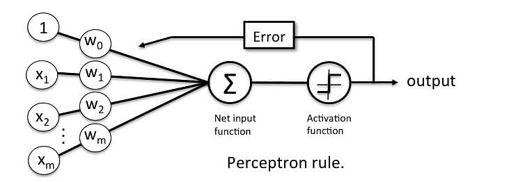
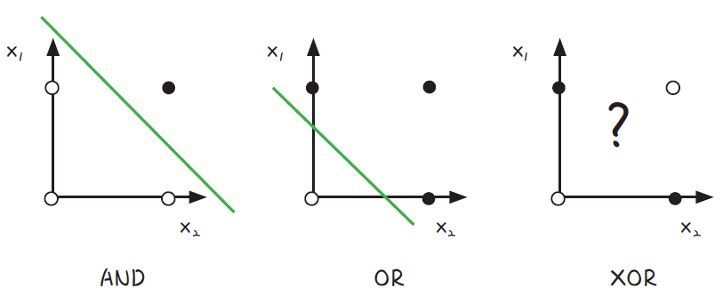
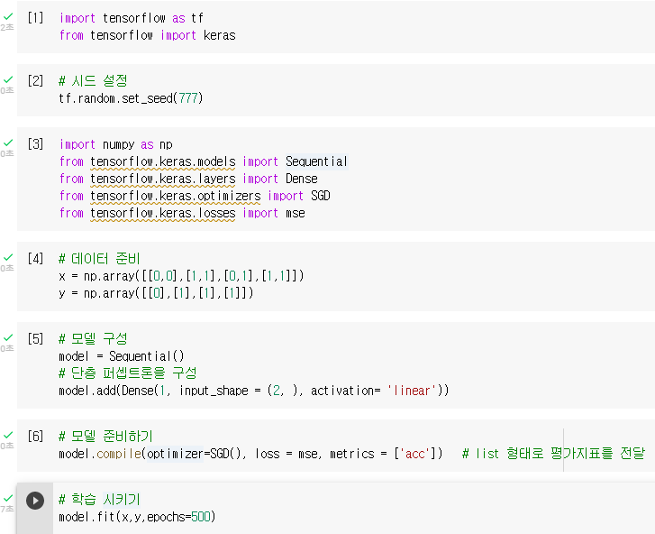
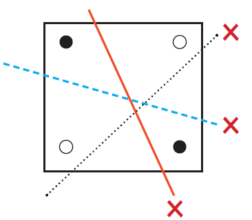
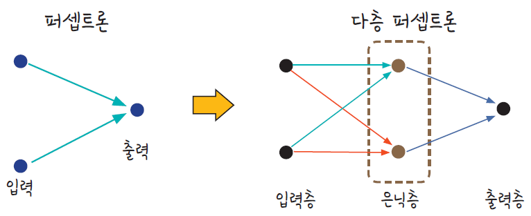
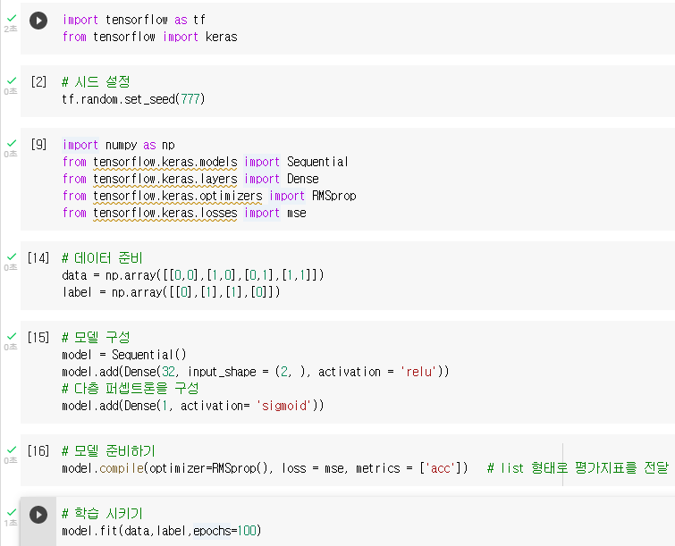

x: 입력값, w: 가중치

**퍼셉트론(perceptron)**은 **x**와 **w**를 곱한 값을 모두 더한 다음 거기에 바이어스 값을 더한 하나의 값(**y, 가중합**)으로 만들어 낸다. 이를 임계값과 비교하여 크면 1, 그렇지 않으면 0을 출력한다. 이렇게 신경망에서 만들어진 값을 **활성화 함수(activation function)**로 적절한 출력값으로 변환시켜준다.

**여러 층의 퍼셉트론을 서로 연결시키고 조합하여 주어진 입력 값에 대한 판단을 하게 하는 것.**
그것이 바로 신경망의 기본 구조이다.

최종 결과값은 정해놓은 정답과 비교하게 되는데, 특정 알고리즘을 사용하여 최적값을 찾을 때까지 가중치를 업데이트하면서 학습을 반복하게 된다.

#### **※ 퍼셉트론의 과제**

**단 하나의 퍼셉트론으로는 많은 것을 기대할 수가 없다.** 예를 들어 결과값이 0이면 흰점으로, 1이면 검은점으로 나타낸 후 직선을 그어 위 조건을 만족할 수 있는지 보자.

AND, OR, XOR 진리표대로 좌표 평면에 표현한 뒤 선을 그어 색이 같은 점끼리 나누기 (XOR 은 불가능. [모두의 딥러닝]

- AND 와 OR 게이트는 직선을 그어 결과값이 1인 값(검은점)을 구별할 수 있다.
  **즉, 퍼셉트론을 이용하면 AND, OR, NAND 게이트 또한 해결할 수 있다.**

위 코드로 OR 게이트 문제를 해결할 수 있는 모델을 생성해봤다. 동일한 결과를 얻을 수 있는 이유는 시드를 고정했기 때문이다.

**랜덤 시드(random seed)**는 실험에서 재생산성을 위한 중요한 설정 중 하나임을 기억하자.

\- **그러나 XOR 의 경우 선을 그어 구분할 수 없다.**

\- 이는 인공지능 분야의 선구자였던 MIT 의 마빈 민스키 (Marvin Minsky ) 교수가 1969 년에 발표한 퍼셉트론즈 Perceptrons 라는 논문에 나오는 내용: ‘뉴런 → 신경망 → 지능’이라는 도식을 따라 퍼셉트론 → 인공 신경망 →
인공지능’이 가능하리라 꿈꾸던 당시 사람들은 이것이 생각처럼 쉽지 않다는 사실을 깨닫게 된다. 이 논문 이후 인공지능 연구가 한동안 침체기를 겪게 된다. 10여년이 지난 후에야 이 문제가 해결되는데, 이를 해결한 개념이 바로 다층 퍼셉트론(multilayer perceptron)이다.

### **다층 퍼셉트론**

고정관념을 깬 기발한 아이디어에서 해결점이 보인다.

XOR 문제를 해결하기 위해 **좌표 평면 자체에 변화를 주는 것**. 두 개의 퍼셉트론을 한 번에 계산할 수 있어야 한다.

이를 가능하게 하려면 숨어있는 층, 즉 **은닉층(hidden layer)을 만들면 된다**. 은닉층이 좌표 평면을 왜곡시키는 결과를 가져온다.

여러 개의 퍼셉트론을 쌓아 올린 구조이다. 이 때, 퍼셉트론을 여러 개 쌓게 되면 수많은 **가중치**를 다뤄야 한다. 위의 그림에서 보이는 수많은 선이 전부 가중치에 해당한다고 생각하면 된다. 위의 그림은 단순한 퍼셉트론이며 실제로 사용할 퍼셉트론은 수십 배가 넘는다. 실제 학습에서 이를 단순하게 곱하여 출력을 만드는 경우 상당한 연산 비용이 발생하며, 좀 더 단순하고 효율적으로 계산하기 위해서 벡터화를 이용하며 ,내적을 통해 연산을 수행한다.

- XOR 게이트 구현 + 다층 퍼셉트론

첫 번째 Dense층에서 32개의 퍼셉트론을 구성했다. 퍼셉트론을 여러 개 쌓음으로 인해서 XOR 문제를 해결할 수 있었다.